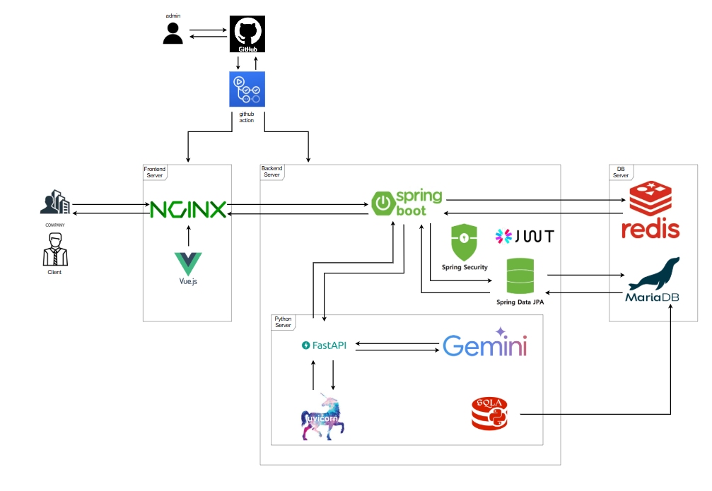
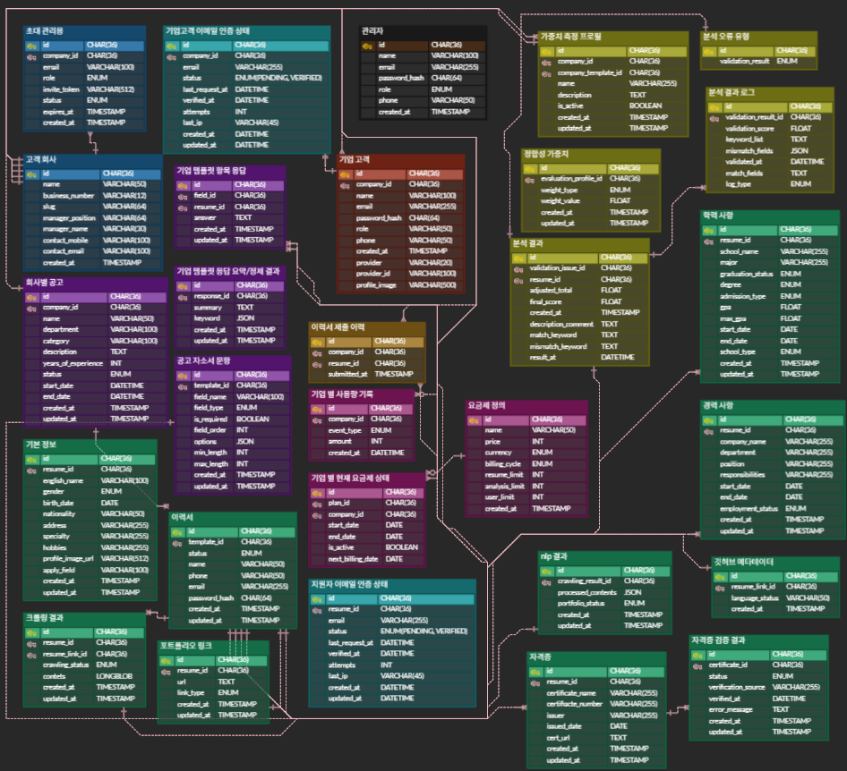

  

## 👥팀원  

| 서현원 | 김택곤 | 이원진 | 이인화 | 조상원 | 최정우 |
| :---: | :---: | :---: | :---: | :---: | :---: |
|   |   |    |   |   |  |
| |  |  |  |  |  |

## 📚 목차

1. [프로젝트 개요](#1-프로젝트-개요)  
2. [요구사항 명세서](#2-요구사항-명세서)  
3. [기술 스택](#3-기술-스택)  
4. [시스템 아키텍처](#4-시스템-아키텍처)  
5. [데이터베이스 설계 (ERD)](#5-데이터베이스-설계-erd)
6. [테이블-명세서](#6-테이블-명세서)
7. [화면 기능 설계서 및 API 설계](#7-화면-기능-설계서-및-api-설계)
8. [기여 가이드](#8-기여-가이드)  
9. [향후 개선 계획](#9-향후-개선-계획)

 

##  1. 프로젝트 개요  
#### 1.1 프로젝트 소개
**SpecGuard**는 기업의 인사 담당자가 이력서 및 포트폴리오의 정합성을 자동으로 검사하고, 신뢰도 있는 채용 결정을 지원하는 B2B SaaS 플랫폼입니다.

- 지원자는 **폼 기반**으로 이력 정보를 입력
- 시스템은 자동으로 **내용 요약, 키워드 추출, 일치율 점수 계산**
- 기업은 신뢰성 높은 지원자 평가를 통해 **채용 리스크 최소화**

#### 1.2 프로젝트 배경
- **허위/과장 기재로 인한 검증 리스크**  
    일부 지원자는 실제로 보유하지 않은 기술을 이력서에 기재하거나, 형식적으로만 구성된 포트폴리오를 첨부하는 사례가 존재합니다.
    이는 채용 후 업무 적응 실패, 기업 평판 저하 등의 문제로 이어질 수 있습니다.

- **포트폴리오 정보의 비표준화 문제**  
    다양한 형태의 포트폴리오(개인 블로그, 깃허브, 노션 등)가 존재하므로, 이를 일관된 기준으로 평가하기 어렵습니다.

- **검증 피로도 및 시간 낭비**  
    수많은 이력서를 검토하는 HR 담당자나 실무진은, 포트폴리오나 자격 정보를 하나씩 확인하는 데 많은 시간을 소모하며, 그 과정에서 중요한 핵심 역량을 놓치기도 합니다.  
  
(출처 : https://www.ohmynews.com/NWS_Web/View/at_pg.aspx?CNTN_CD=A0003053666)    
  

(출처:https://www.hankyung.com/article/202507224138i)

 

 

## 2. 요구사항 명세서

### 기능 요구사항

#### 2.1 요약

| 요구사항 ID | 대분류 | 중분류 | 소분류 | 상세 설명 | 중요도 |
|-------------|--------|--------|--------|-----------|--------|
| FR-01 | 이력서 제출 | 폼 입력 | 기본 정보 입력 | 지원자가 이름, 연락처, 학력 등을 입력 | ★★★ |
| FR-02 | 정합성 분석 | Gemini 활용 | 요약 | 자기소개서 요약 생성 (3~5문장) | ★★☆ |
| FR-03 | 정합성 분석 | Cos 유사도 계산 |일치율 판단 | 자소서 vs 포트폴리오 간 유사도 측정 | ★★★ |
| FR-04 | 크롤링 | URL |포트폴리오 수집 | Notion, Velog 등 외부 포트폴리오 수집 | ★★☆ |
| FR-05 | 검증 리포트 | PDF 형식 |검증 결과 제공 | 검증 점수 및 사유 포함 리포트 자동 생성 | ★★★ |

#### 2.2 전문

요구사항 명세서 링크

  
[요구사항 명세서](https://docs.google.com/spreadsheets/d/1_VCJofMDKv3oDyNVuIkYaGBFm2pezy_r_WRvxPwOQ-A/edit?gid=1380067657#gid=1380067657)

 

## 3. 기술 스택

#**Frontend**
 

#**Backend**
 

#**Crawler**
 

#**NLP 분석**
 

#**Database**
 

#**API Platform**
 

#**Tools&External References**
 

  

 

## 4. 시스템 아키텍처

 

## 5. 데이터베이스 설계 (ERD)

### ERD
[ERD CLOUD](https://www.erdcloud.com/d/jAJ6DJnaAkz2GKoJX)

  

 

## 6. 테이블 명세서

[테이블 명세서](https://docs.google.com/spreadsheets/d/1rohN4_s3YLDfYMuYjYqJgqTp1kEWab0ajzBy4B2j8YY/edit?usp=sharing)

 

## 7. 화면 기능 설계서 및 API 설계

### 7.1 화면 기능 설계서
[화면 기능 설계서](https://www.figma.com/design/lgxhAzsihIkBahgsgE6fPL/SpecGuard-%ED%99%94%EB%A9%B4-%EC%84%A4%EA%B3%84%EC%84%9C?node-id=66-137&t=0YHbF7USg7Nyz9WU-1)

### 7.2 API 명세서
[API 명세서](https://www.notion.so/API-2455605940ec80d0a6cecfb101029e19?source=copy_link)

 

## 8. 테스트 결과서

## 8.1 벡엔드 테스트 결과서
 
[벡엔드 테스트 결과서](https://www.notion.so/2775605940ec801286d6f888af3e93d2?v=2775605940ec80ba931c000c1fcfe3ed)

## 8.2 프론트엔드 테스트 결과서
 
[프론트엔드 테스트 결과서](https://www.notion.so/2775605940ec80b7aadee6394114d26c?v=2775605940ec811dafd4000ce77c5a78)

## 10. 기여 가이드
이슈 등록

feature/이슈명 브랜치 생성

커밋 메시지 규칙: feat: ..., fix: ..., docs: ...

Pull Request 템플릿 기반 작성 후 리뷰 요청

 

## 11. 향후 개선 계획

분석 정확도 개선을 위한 모델 업그레이드

적절한 에러처리

통계 및 리포트 페이지 구현

B2B 고객사를 위한 SaaS 대시보드 고도화

 

# 12. 회고록

|   조원 이름	| 회고  	 |
|---	|-------|
|   서현원   | 조장으로서 부족한 점이 많았지만, 팀원들이 적극적으로 따라와 주고 협력해 준 덕분에 프로젝트를 잘 마무리할 수 있었습니다. 이번 프로젝트에서는 처음 보는 기술들을 사용하며 많은 것을 배웠고, 이를 통해 앞으로 있을 프로젝트에서도 더 효과적으로 적용하고 개선할 수 있는 자신감을 얻었습니다. 무엇보다 팀워크와 소통의 중요성을 다시 한 번 느꼈고, 함께 노력한 경험이 큰 자산이 되었습니다. 비욘드 캠프, 화이팅! SpecGuard, 파이팅! |
|   최정우   | 이번 프로젝트에서 나는 Spring Security 기반 인증·인가와 SpecGuard 제출 파이프라인을 맡았다. 회원 가입·로그인 시 JWT 발급과 검증 로직을 구현해 보안 체계를 세웠고, OAuth2.0 소셜 로그인을 성공적으로 붙여 사용자 경험을 개선했다. 제출 파이프라인은 이력서 제출 시 크롤링·자격증 검증·NLP 분석을 자동으로 수행하도록 이벤트 기반으로 설계했으며, 초기 병목 구조를 단순화하고 스케줄러를 개선해 안정성을 높였다.진행 과정에서 @Async 동작 한계를 뒤늦게 깨닫고 비동기 로직을 재설계해야 했고, 통합 테스트 부족으로 팀 코드에 영향을 준 점은 아쉬움으로 남는다. Kafka 같은 메시지 브로커를 도입하지 못해 확장성 면에서도 아쉬웠지만, 대신 이벤트 아키텍처와 동시성 제어에 대한 실제 경험을 쌓을 수 있었다. 무엇보다 협력적인 팀 분위기 덕분에 끝까지 지치지 않고 완주할 수 있었고, 이번 경험은 안정적인 인증 체계와 자동화된 프로세스를 직접 구현한 값진 배움으로 남았다. |
|   조상원   | 이번 프로젝트는 제가 처음으로 경험한 비교적 큰 규모의 작업이었는데, 전체적인 큰 틀과 흐름을 이해하는 데 큰 도움이 되었습니다. 또한 처음 접하는 기술 스택들도 많아 다양한 지식을 새롭게 얻을 수 있었습니다. 다만 시간이 촉박해 설계를 빠르게 마무리하다 보니 개발 과정에서 설계의 허점들이 드러났고, 이를 통해 설계의 중요성을 다시 한번 깊이 느낄 수 있었습니다. 앞으로 진행할 프로젝트들에서 이번 프로젝트를 하면서 느낀 점들과 배운 점들을 잊지 않고 계속해서 활용하고 발전해 나가겠습니다. 다들 고생하셨습니다~! |
|   이인화   | 	     |
|   김택곤 	 | dfds  	 |
|   이원진 	 | 	     |
