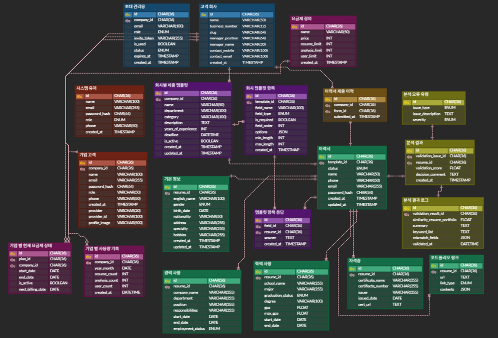

# 📄 SpecGuard - 이력 검증 시스템

<br/>

## 📚 목차

1. [프로젝트 개요](#1-프로젝트-개요)  
2. [요구사항 명세서](#2-요구사항-명세서)  
3. [기술 스택](#3-기술-스택)  
4. [시스템 아키텍처](#4-시스템-아키텍처)  
5. [데이터베이스 설계 (ERD)](#5-데이터베이스-설계-erd)
6. [테이블-명세서](#6-테이블-명세서)
7. [기능 흐름 및 API 설계](#7-기능-흐름-및-api-설계)
8. [기여 가이드](#8-기여-가이드)  
9. [향후 개선 계획](#9-향후-개선-계획)

<br/>

## <a id="1-프로젝트-개요"></a> 1. 프로젝트 개요  
#### 1.1 프로젝트 소개
**SpecGuard**는 기업의 인사 담당자가 이력서 및 포트폴리오의 정합성을 자동으로 검사하고, 신뢰도 있는 채용 결정을 지원하는 B2B SaaS 플랫폼입니다.

- 지원자는 **폼 기반**으로 이력 정보를 입력
- 시스템은 자동으로 **내용 요약, 키워드 추출, 일치율 점수 계산**
- 기업은 신뢰성 높은 지원자 평가를 통해 **채용 리스크 최소화**

#### 1.2 프로젝트 배경
- **허위/과장 기재로 인한 검증 리스크**  
    일부 지원자는 실제로 보유하지 않은 기술을 이력서에 기재하거나, 형식적으로만 구성된 포트폴리오를 첨부하는 사례가 존재합니다.
    이는 채용 후 업무 적응 실패, 기업 평판 저하 등의 문제로 이어질 수 있습니다.
    
- **포트폴리오 정보의 비표준화 문제**  
    다양한 형태의 포트폴리오(개인 블로그, 깃허브, 노션 등)가 존재하므로, 이를 일관된 기준으로 평가하기 어렵습니다.
    
- **검증 피로도 및 시간 낭비**  
    수많은 이력서를 검토하는 HR 담당자나 실무진은, 포트폴리오나 자격 정보를 하나씩 확인하는 데 많은 시간을 소모하며, 그 과정에서 중요한 핵심 역량을 놓치기도 합니다.  
  
(출처 : https://www.ohmynews.com/NWS_Web/View/at_pg.aspx?CNTN_CD=A0003053666)    
<br><br>

(출처:https://www.hankyung.com/article/202507224138i)

<br/>

## 2. 요구사항 명세서

### 기능 요구사항

#### 2.1 요약

| 요구사항 ID | 대분류 | 중분류 | 소분류 | 상세 설명 | 중요도 |
|-------------|--------|--------|--------|-----------|--------|
| FR-01 | 이력서 제출 | 폼 입력 | 기본 정보 입력 | 지원자가 이름, 연락처, 학력 등을 입력 | ★★★ |
| FR-02 | 정합성 분석 | Gemini 활용 | 요약 | 자기소개서 요약 생성 (3~5문장) | ★★☆ |
| FR-03 | 정합성 분석 | Cos 유사도 계산 |일치율 판단 | 자소서 vs 포트폴리오 간 유사도 측정 | ★★★ |
| FR-04 | 크롤링 | URL |포트폴리오 수집 | Notion, Velog 등 외부 포트폴리오 수집 | ★★☆ |
| FR-05 | 검증 리포트 | PDF 형식 |검증 결과 제공 | 검증 점수 및 사유 포함 리포트 자동 생성 | ★★★ |

#### 2.2 전문
<details>
<summary>요구사항 명세서 링크</summary>
<div markdown="1">
  
[요구사항 명세서](https://docs.google.com/spreadsheets/d/1_VCJofMDKv3oDyNVuIkYaGBFm2pezy_r_WRvxPwOQ-A/edit?gid=1380067657#gid=1380067657)

</div>
</details>

<br/>


## 3. 기술 스택

| 영역 | 기술 |
|------|------|
| Frontend | Vue.js |
| Backend | Spring Boot, JPA, JWT, REST API |
| 크롤러 | Python (FastAPI), BeautifulSoup |
| NLP 분석 | Python (KoNLPy, transformers) |
| Database | MariaDB |

<br/>

## 4. 시스템 아키텍처

4.1 예시
```plaintext
사용자 → 프론트엔드 → Spring Boot API
                          ↓
                  [크롤러] + [NLP 모듈] → DB 저장
```

<br/>


## 5. 데이터베이스 설계 (ERD)

### ERD



<br>


## 6. 테이블 명세서

[테이블 명세서](https://docs.google.com/spreadsheets/d/1rohN4_s3YLDfYMuYjYqJgqTp1kEWab0ajzBy4B2j8YY/edit?usp=sharing)

<br>

## 7. 기능 흐름 및 API 설계

### 7.1 기능 흐름 요약
사용자 → 이력서 폼 작성

백엔드 → 포트폴리오 크롤링 및 NLP 요약

백엔드 → 정합성 점수 산출 및 저장

관리자/기업 → 결과 조회 및 보고서 확인

### 7.2 API 명세서
[API 명세서](https://www.notion.so/API-2455605940ec80d0a6cecfb101029e19?source=copy_link)

<br/>


## 8. 기여 가이드
이슈 등록

feature/이슈명 브랜치 생성

커밋 메시지 규칙: feat: ..., fix: ..., docs: ...

Pull Request 템플릿 기반 작성 후 리뷰 요청


<br/>


## 9. 향후 개선 계획

분석 정확도 개선을 위한 모델 업그레이드


B2B 고객사를 위한 SaaS 대시보드 고도화

<br/>
